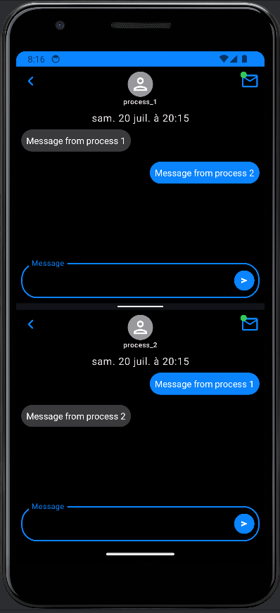

# Android IPC using gRPC

## Installation

Clone this repository and import into **Android Studio**

```bash
git clone git@github.com:sullmin/android_ipc_grpc.git
```

## Build variants

Use the Android Studio *Build Variants* button to install **process_1** and **process_2** flavors
combined with debug and release build types

## Run

Start application `process_1` and `process_2`.

Top right Email icon on each applications must have green pill, **if** pills blink red it's because
*service* are not running.

Connexion with service *valide*


Connexion with service ***invalide***


To improve experience, ***run*** both applications on `split screen`.
***Now***, send message on both applications.

Example of both application running on split screen, it's also work when application running
normally.


## Configuration of AVD used for test

***AVD*** running on API 34

```
Properties
avd.ini.displayname Pixel_3a_API_34_extension_level_7_x86_64
avd.ini.encoding UTF-8
AvdId Pixel_3a_API_34_extension_level_7_x86_64
disk.dataPartition.size 6442450944
hw.accelerometer yes
hw.arc false
hw.audioInput yes
hw.battery yes
hw.camera.back emulated
hw.camera.front emulated
hw.cpu.ncore 4
hw.device.hash2 MD5:0e6953ebf01bdc6b33a2f54746629c50
hw.device.manufacturer Google
hw.device.name pixel_3a
hw.dPad no
hw.gps yes
hw.gpu.enabled yes
hw.gpu.mode auto
hw.keyboard yes
hw.lcd.density 440
hw.lcd.height 2220
hw.lcd.width 1080
hw.mainKeys no
hw.ramSize 1536
hw.sdCard yes
hw.sensors.orientation yes
hw.sensors.proximity yes
hw.trackBall no
image.androidVersion.api 34
image.sysdir.1 system-images/android-34/google_apis/x86_64/
PlayStore.enabled false
runtime.network.latency none
runtime.network.speed full
snapshot.present no
tag.display Google APIs
tag.id google_apis
vm.heapSize 256
```